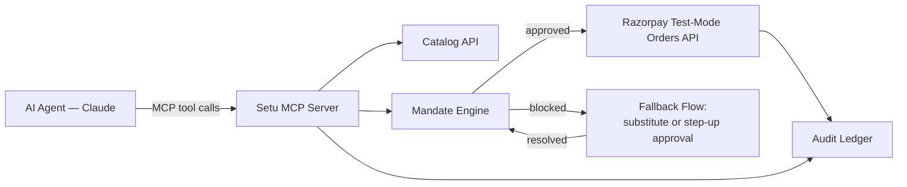

# Setu

**A trust layer for agent-to-agent commerce.** An AI agent discovers a merchant's
catalog, has its spending authority checked against a **mandate**, completes a real
purchase on Razorpay's test-mode rails, and leaves an auditable trail behind every
decision.

Built for the **Razorpay AI Buildathon 2026 — Track 01, AI Growth & Agentic Commerce**.

> *Setu* (सेतु) means "bridge" — this is a bridge between AI buyers and a Razorpay merchant.

**The chain of trust, plainly:** a **Customer** grants a **mandate** → their **AI
Agent** operates under it → **Setu**, running at the merchant's end, checks and
gates every purchase attempt against that mandate → **Razorpay** handles the
actual money movement → the **Merchant** receives a payment it can trust was
authorized.

> **Status: the full money path is built and tested end to end** — mandate
> engine, MCP tool surface, audit ledger, and the graceful-failure recovery
> flow, including a real captured Razorpay test payment. See [Status](#status).

---

## The problem

Agents are about to start buying things on people's behalf. NPCI's **UAP**, OpenAI/Stripe's
**ACP**, Google's **AP2**, and Coinbase's **x402** are all racing to define how, and they
converge on the same three primitives:

1. an **agent-readable catalog**,
2. **bounded spending authority** instead of a blank cheque,
3. an **explainable trail** behind every purchase.

Primitive 2 is largely solved already, from the customer's side — a mandate is how
a customer grants their agent bounded spending authority in the first place, issued
by a bank, a wallet, or an agent platform. What's missing is the other side of the
transaction: nothing tells the **merchant** that a given purchase attempt actually
carries that authority, or lets the merchant prove it after the fact. A customer can
delegate all the spending authority they like — if the merchant has no way to check
it, or show it was checked, that authority never crosses the counter.

Setu is that missing side. A customer delegates purchasing to an AI agent with
bounded spending authority; the agent shops and calls to buy; Setu — running at the
merchant's end — checks every purchase attempt against the mandate before Razorpay
is ever contacted, and records the decision either way. The mandate is what protects
the *customer*, from an agent (or a bug, or a bad instruction) overspending. The
audit trail is what lets the *merchant* trust the channel enough to accept the
purchase at all. Put directly: bounded, provable spending authority is what makes a
merchant comfortable accepting AI-agent payments in the first place — without it, an
AI buyer is indistinguishable from an unbounded one, and no merchant can safely say
yes to that.

Setu is not a recommendation engine, and it does not interpret or preserve shopping
intent. It only governs whether a purchase's amount and category are authorized —
matching what actually gets bought to what the customer meant is the agent's job,
not Setu's.

## Architecture



The `Fallback Flow` node ranks substitutes by what the mandate permits, not by how
well they match the request — Setu governs authorization, not recommendation.

| Module | Role |
| --- | --- |
| `catalog.js` | Agent-readable product feed, 12 SKUs for a fictional campus tech store |
| `mandate.js` | Spend cap + per-transaction cap + category allowlist + expiry — *bounded and gated* |
| `payments.js` | Razorpay order creation and HMAC signature verification |
| `server.js` | MCP server (stdio) — the tool surface an agent calls |
| `server-http.js` | HTTP API and the browser checkout used to prove the payment rails |

`catalog.js`, `mandate.js` and `payments.js` are pure logic — no HTTP, no MCP. Both the
HTTP layer and the MCP layer import the same functions, so the two cannot drift.

### A note on money

Every amount in this codebase is an **integer count of paise**, never a decimal rupee
value. Binary floating point cannot represent most decimal fractions exactly, and the
resulting error is enough to flip a mandate cap comparison — the one decision this
project is graded on. Rupees appear only in display strings.

## Setup

```bash
npm install

cp .env.example .env      # then add your Razorpay test-mode keys
```

`.env` needs:

```
RAZORPAY_KEY_ID=rzp_test_xxxxxxxxxxxx
RAZORPAY_KEY_SECRET=xxxxxxxxxxxxxxxxxxxxxxxx
```

Credentials load through Node's built-in `--env-file` flag (Node 20.6+); there is no
`dotenv` dependency.

### Run

```bash
node --env-file=.env server-http.js    # HTTP API + checkout page on :3000
npm test                               # mandate + MCP tool + recovery-flow assertions
```

### Register the MCP server

```bash
claude mcp add --transport stdio setu -- node --env-file=.env server.js
claude mcp list                        # setu should report Connected
```

An MCP server is loaded at session start, so start a **new** Claude Code session after
registering. Then just talk to it — *"browse the catalog and buy me a phone case under ₹500"*.

## HTTP API

| Route | Description |
| --- | --- |
| `GET /catalog` | Whole catalog as `{ currency, unit, products }` |
| `GET /product/:id` | One product in the same envelope; 404 if unknown |
| `POST /checkout` | Creates a Razorpay order from a `productId` |
| `POST /payment/verify` | Recomputes the HMAC signature server-side |

Responses state their own units, so an agent reading `price: 29900` can tell that means
₹299.00 and not ₹29,900.

```bash
curl -s http://localhost:3000/product/cbl-usbc-1m
```
```json
{ "currency": "INR", "unit": "paise",
  "product": { "id": "cbl-usbc-1m", "name": "USB-C to USB-C Cable (1m)", "price": 29900, "...": "..." } }
```

> `POST /checkout` is intentionally **not** mandate-gated. It exists to prove the Razorpay
> rails work from a browser. The mandate check gates agent purchases, in the `initiate_purchase`
> MCP tool.

## Status

Both build days are complete. The full money path is proven end to end — mandate
check, order creation, checkout, capture, and audit — including a real captured
Razorpay test payment (see [`CHALLENGES.md`](./CHALLENGES.md)).

- [x] MCP server registered and round-tripping over stdio
- [x] Agent-readable catalog with a self-describing response envelope
- [x] Razorpay order creation, checkout page, HMAC signature verification *(confirmed with a real captured test payment)*
- [x] Mandate engine — per-transaction cap, total budget, category allowlist, expiry
- [x] MCP tool surface — `search_catalog`, `get_product`, `check_mandate`, `initiate_purchase`, `get_audit_log`
- [x] Audit ledger + explainability view
- [x] Graceful failure: over-limit purchase blocked → substitute offered → recovery

`npm test` runs all three suites — mandate, MCP tool, and recovery-flow assertions —
20/20, 34/34, 5/5, exit 0.

## Build log

Real obstacles hit during the build are logged in [`CHALLENGES.md`](./CHALLENGES.md).

## License

ISC
